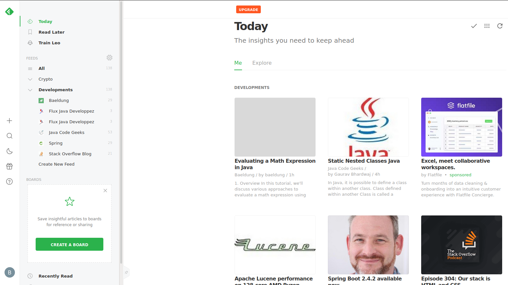

# Projet-11-OC
Effectuez un stage ou construisez une veille technologique

## Description d'une veille technologique

Dans le monde du développement, le développeur doit se tenir au courant des nouveautés qu'il le concerne.
C'est un domaine en perpétuel évolution, il faut donc que le développeur soit en lien avec la communauté.

Pour cela, le développeur construit sa veille technologique : 

1. Listes des technologies ou des thématiques suivis :
    * Java
    * Spring 
    * Développement Back-end
    * Développement Front-end
    
2. Actualités sur les techonologies et des thématiques suivis :
    * StackOverFlow, Baeldung, JM Doudoux, Java Code Geeks, ...
    
3. Outils de veille :

* Feedly
  
* TweetDeck
  